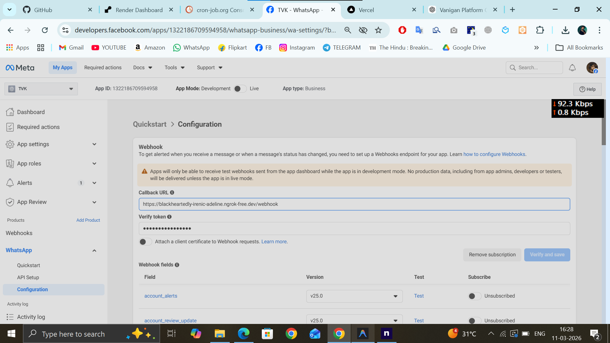
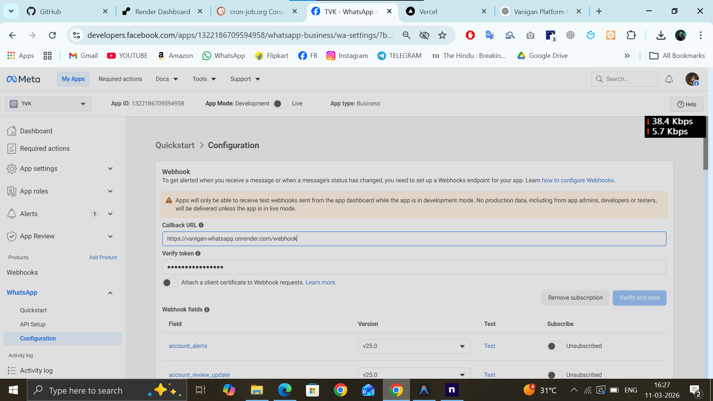
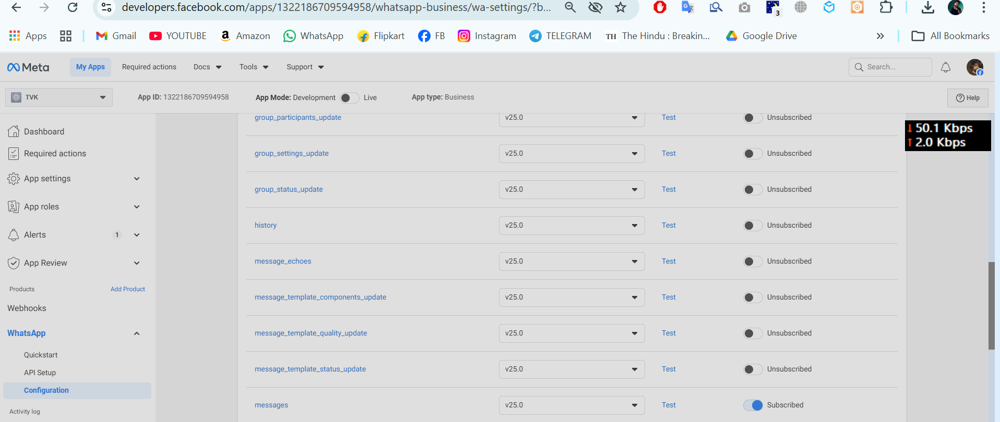

# 🚀 Vanigan End-to-End Deployment Guide

Welcome! Since this is your first time setting up the **Vanigan Platform**, this guide will walk you through setting up the **WhatsApp Bot** and the **Web Portal** from scratch.

---

## 🛠️ Step 1: Local Development Setup

Use this setup when you are making changes and want to test the bot on your own phone.

### 1. Prerequisites
- **Node.js**: Install from [nodejs.org](https://nodejs.org/).
- **Ngrok**: Essential for receiving Meta's messages locally.

### 2. Project Installation
```bash
# Clone the repository
git clone https://github.com/tmisgowthaamand/Vanigan-WhatsApp.git
cd vanigan-whatsapp-bot

# Install Bot & Frontend dependencies
npm install
cd vanigan-frontend
npm install
cd ..
```

### 3. Environment Config (`.env`)
Create a file named `.env` in the root folder and paste this:
```env
WHATSAPP_APP_ID=1322186709594958
WHATSAPP_VERIFY_TOKEN=vanigan-whatsapp-2026
WHATSAPP_API_TOKEN=EAANAWoZA8vz8BQlCwQuuYaVxYybCGDJ7iC3ojZAHUVGfM3MKOcHEVauJ6H6peihBSSZBlDKBpNk5LpVed6LwyeThT0LvXFFPtaf0dQ2Pzndtr6QfKJO8ZAyAC7kF3OUNzWa5rI1GjuibuZAyouRKlniBn4UWKUCZAMSjcEemlLMbhtDDWqFQYXwZAQd24e7w3cmXMhY7k0t6IHraIPL5EJqgrPYJZBqto07RhnR3
WHATSAPP_PHONE_NUMBER_ID=949977628193093
WHATSAPP_WEBHOOK_URL=https://blackheartedly-irenic-adeline.ngrok-free.dev/webhook
FRONTEND_URL=https://vanigan-whats-app.vercel.app/

```

### 🛠️ Meta Webhook Configuration

**Localhost Setup:**
 

**Production Setup:**


**Step: Switch-On "Messages" Button**



### 4. Running the Bot Locally
1. **Start the Bot**:
   ```bash
   node index.js
   ```
2. **Start the Frontend**:
   ```bash
   cd vanigan-frontend
   npm run dev
   ```
3. **Connect to Meta**:
   Your local ngrok URL is already pre-configured:
   `https://blackheartedly-irenic-adeline.ngrok-free.dev/webhook`
   
   Update this URL in the **Meta Business Dashboard > WhatsApp > Configuration**.

---

## 🚀 Step 2: Production Deployment (Live)

When you are ready to make the bot live for all users.

### 1. Backend (WhatsApp Bot) on Render
The bot is hosted on **Render**.
- **URL**: `https://vanigan-whatsapp.onrender.com`
- **Webhook Endpoint**: `https://vanigan-whatsapp.onrender.com/webhook`

**Setup on Render Dashboard:**
1. Connect your GitHub repository.
2. Select **Web Service**.
3. **Build Command**: `npm install`
4. **Start Command**: `node index.js`
5. **Environment Variables**: Configure these in the Render "Environment" tab:
   ```env
   WHATSAPP_APP_ID=1322186709594958
   WHATSAPP_VERIFY_TOKEN=vanigan-whatsapp-2026
   WHATSAPP_API_TOKEN=EAANAWoZA8vz8BQlCwQuuYaVxYybCGDJ7iC3ojZAHUVGfM3MKOcHEVauJ6H6peihBSSZBlDKBpNk5LpVed6LwyeThT0LvXFFPtaf0dQ2Pzndtr6QfKJO8ZAyAC7kF3OUNzWa5rI1GjuibuZAyouRKlniBn4UWKUCZAMSjcEemlLMbhtDDWqFQYXwZAQd24e7w3cmXMhY7k0t6IHraIPL5EJqgrPYJZBqto07RhnR3
   WHATSAPP_PHONE_NUMBER_ID=949977628193093
   WHATSAPP_WEBHOOK_URL=https://vanigan-whatsapp.onrender.com/webhook
   FRONTEND_URL=https://vanigan-whats-app.vercel.app/
   ```

### 2. Frontend (Web Portal) on Vercel
The website is hosted on **Vercel**.
- **URL**: `https://vanigan-whats-app.vercel.app`

**Setup on Vercel Dashboard:**
1. Connect GitHub and select the `vanigan-frontend` folder.
2. Framework: **Vite**.
3. Deploy!

---

## 📲 Step 3: Meta Dashboard Configuration

To make the bot respond to WhatsApp messages:

1. Go to [Meta for Developers](https://developers.facebook.com/).
2. Select your App > **WhatsApp** > **Configuration**.
3. **Callback URL**:
   - For Testing: `https://blackheartedly-irenic-adeline.ngrok-free.dev/webhook`
   - For Production: `https://vanigan-whatsapp.onrender.com/webhook`
4. **Verify Token**: `vanigan-whatsapp-2026` (Must match your `.env` value).
5. **Webhook Fields**: Click **Manage** and ensure `messages` is checked.

---

## 💡 Pro-Tips for First-Timers
- **Resetting the Bot**: If you get stuck in a menu, send `9` to return to the Main Menu.
- **Logs**: If the bot isn't replying, check your terminal (local) or the Render logs (production) for errors.
- **Port 3000**: Ensure no other application is using port 3000 when running `node index.js`.
