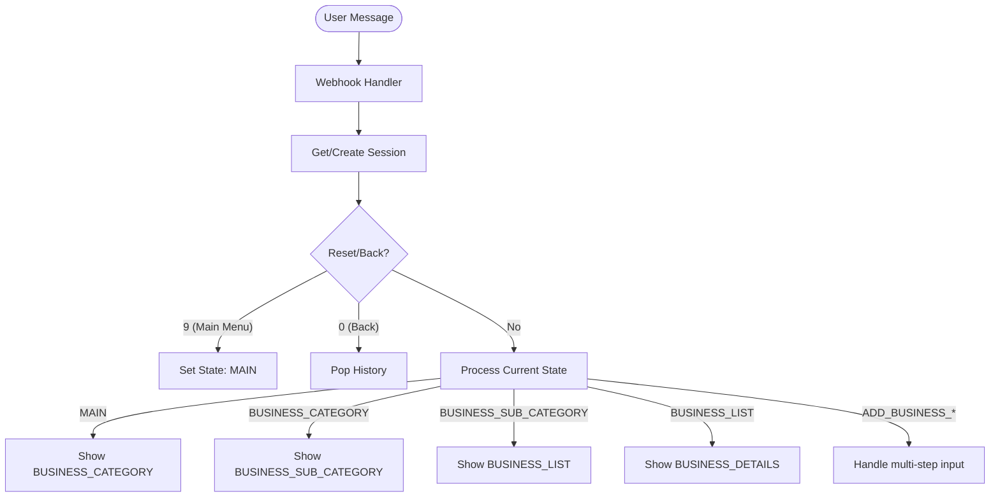

# 🗺️ Vanigan WhatsApp Bot Architecture

## Introduction
The **Vanigan WhatsApp Bot** is a state-managed chatbot built using **Node.js** and **Express.js**, integrated with **Meta's WhatsApp Cloud API (v18.0)**. 

The bot is designed to handle user requests using a **State Machine** pattern, which allows for complex, multi-step user interactions like registering a business or navigating deep nested menus.

---

## 🏗️ System Components

### 1. Webhook Controller (`index.js`)
- **GET /webhook**: Used for verification. Meta sends a challenge that the bot must respond to.
- **POST /webhook**: The main endpoint that receives real-time messaging updates from WhatsApp. 

### 2. Session Manager (`getSession`)
- Currently uses an **in-memory** `sessions` object.
- **Key Structure**:
```javascript
sessions[userId] = {
    state: 'MAIN',       // The current location of the user in the menu
    history: [],         // A stack to handle "Back" (0) navigation
    temp: {}             // Temporary object to store user inputs durante multi-step processes
}
```

### 3. Messaging Engine
- **`sendTextMessage`**: Sends standard UTF-8 text.
- **`sendImageMessage`**: Sends an image with an optional caption.
- **`sendListMessage`**: Sends an interactive "List" (up to 10 rows).
- **`sendButtonsMessage`**: Sends interactive "Quick Reply" buttons (up to 3).

---

## 🚦 The State Machine Flow

The bot uses a `switch` statement inside the `POST /webhook` handler to decide the response based on the user's current `state`.

### 🔄 Flow Diagram (Conceptual)


### 📄 State Definitions

| State | Description | Next Possible States |
| :--- | :--- | :--- |
| `MAIN` | The entry point showing all core services. | `BUSINESS_CATEGORY`, `ORG_DISTRICT`, `MEMBERS_DISTRICT`, `ADD_BUSINESS_NAME`, `SUBSCRIPTION`, `NEWS_DISTRICT` |
| `BUSINESS_CATEGORY` | Users select an industry type. | `BUSINESS_SUB_CATEGORY` |
| `BUSINESS_SUB_CATEGORY`| Users narrow down their search. | `BUSINESS_LIST` |
| `BUSINESS_LIST` | A list of matching businesses. | `BUSINESS_DETAILS` |
| `BUSINESS_DETAILS` | Detailed info, call button, and map link. | `BUSINESS_LIST`, `MAIN` |
| `ADD_BUSINESS_*` | A series of states to collect business data. | `ADD_BUSINESS_CONFIRM` |

---

## 🛠️ Data Strategy

Currently, the bot uses **Static Mock Data** for:
- `MENUS.BUSINESS_LIST`
- `MENUS.ORGANIZER_LIST`
- `MENUS.MEMBER_LIST`
- `MENUS.NEWS_LIST`

### 🔮 Upgrade Path: Dynamic Data
To make the bot production-ready for thousands of users:
1.  **Database**: Replace the `MENUS` object with a database (e.g., PostgreSQL or MongoDB).
2.  **API Fetches**: Replace the hardcoded strings with `axios.get()` calls to your backend API.
3.  **Search Logic**: Implement real search/filtering instead of just selecting categories.

---

## 🔐 Security & Scaling

### Token Security
- **WHATSAPP_API_TOKEN**: Use a **Permanent System User Access Token** from the Meta Developer Dashboard. Temporary tokens expire in 24 hours.
- **Verification**: Always ensure the `WHATSAPP_VERIFY_TOKEN` matches what you set in the Meta Dashboard.

### Handling Heavy Traffic
- **In-Memory Limitations**: The current `sessions` object will clear every time the server restarts (e.g., when Render sleeps or redeploys).
- **Redis suggestion**: For scaling, store session data in **Redis**. This allows multiple instances of the bot to share session state and prevents data loss on restarts.

---

## 📤 Future Integration: Media Contexts
The bot is already equipped to handle `image` and `location` message types:
- **Location**: When a user shares their location, it reflects as `location_received`. This can be used to show "Businesses near me".
- **Images**: When a user uploads a photo, it reflects as `image_received`. This is crucial for the "Add Business" flow.
